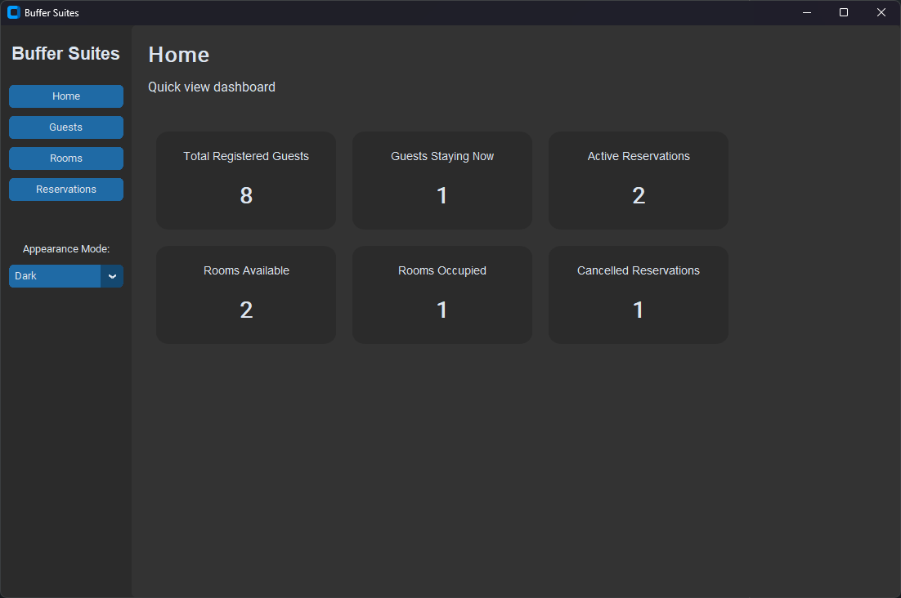
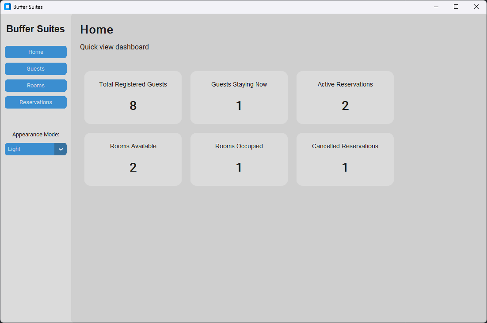

# Hotel Management System - Buffer Suites

The hotel management system is a python GUI application designed to enhance simple hotel operations. It enables guests to reserve rooms, and check-in or check-out, while hotel staff can efficiently manage bookings, and numerous metrics of all guests in real time. This system aims to replace manual processes. The intended users of this application include hotel staff such as administrators, and receptionists.

## Dashboard

